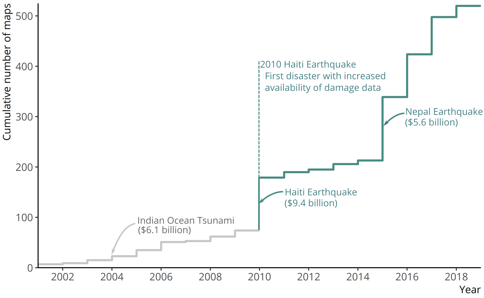

This runs through how I got most of my way there in R to the motivation figure presented in "A geospatial data integration framework to rapidly estimate post-disaster damage" by Sabine Loos , Jack Baker, David Lallemant, Nama Budhathoki, Sang-Ho Yun, Jamie McCaughey, Ritika Singh, and Feroz Khan.  


```{r flowchart, include=T, out.width="70%"}

```

I knew I needed to show that we have a lot of maps on damage that come out after a disaster. So I scraped the website, ReliefWeb, to download all the maps produced after a disaster.

# Load necessary packages and data
```{r message=FALSE, warning=FALSE, include=FALSE}
rm(list=ls(all = T))
library(ggplot2) # one of the best plotting tools around
library(dplyr) # to clean and tidy data
library(scales) # for color palettes (rcolorbrewer is good here too)
```

Load the data on maps. This data was scraped from Reliefweb on 27 June 2019
```{r}
data_rw <- readRDS("data/data_rw_062719.rds")
```

# Explore data
What's in this dataset? Look at the heading to find out:
```{r}
head(data_rw)
```
Looks like it shows what website the map was scraped from, the date that map was posted on that website, and the country it pertains to.

How many maps do we have? Seems to be `r nrow(data_rw)` maps.
```{r}
dim(data_rw)
```

## Plot maps by year
Create a bar chart of the number of maps posted on reliefweb per year
```{r}
ggplot(data_rw) + geom_bar(aes(x = year)) + labs(x = "year", y = "number of maps")
```

Interesting... seems like there was a huge bump in 2010 and 2015. Let's see why.

## Break down bar chart by country
I'm curious if a lot of the maps for these years are from single earthquakes or many earthquakes.
So now I calculate the percentage of maps each year that come from a single country. I use dplyr to create a new dataframe that summarizes the number of maps per country per year, then calculate the percentages for each country. Now we can see that my dataframe for plotting includes 
```{r}
## use dplyr to calculate the percentage of each year per country
perc_rw <- data_rw %>% 
  count(year, country) %>%    #count number in each group
  group_by(year)%>% # Group by region and species, then 
  mutate(pct=n/sum(n),               # Calculate percent within each region
         ypos = cumsum(n))  # Calculate label positions

head(perc_rw)
```

Now I'm able to color the bar chart by the percentage for each country
```{r}
# plot, fill each bar chart by country
ggplot(perc_rw, 
       aes(year, n, fill=country)) +
  geom_bar(stat="identity") + theme(legend.position = "none")+
  labs(x = "year", y = "number of maps")
```

I know that there were two huge earthquakes in Haiti in 2010 and Nepal in 2015. I wonder if those big chunks for those years are because of these earthquakes. Let's add some labels to find out.
```{r}
# create index for events with a large percentage per year
ind <- which(perc_rw$pct > .50)
# plot, fill each bar chart by country
ggplot(perc_rw, 
       aes(year, n, fill=country)) +
  geom_bar(stat="identity") + theme(legend.position = "none")+
  labs(x = "year", y = "number of maps")+
  geom_text(data = perc_rw[ind,] ,aes(year, ypos, label = country), nudge_y = -2)
```

Looks like it. It's also interesting that the Indian ocean tsunami in 2004 didn't seem to have that many maps. I think we have our insight here. For three relatively big earthquakes, the one that happened in 2004 didn't have as many maps produced.

# Highlighting the insight
I wanted to highlight this by adding some color to those years. So what I did was colored everything from Indonesia, Haiti, and Nepal purple.

```{r}
perc_rw <- perc_rw %>%
  group_by(year) %>%
  mutate(country2 = country[which.max(pct)],
         country3 = country[which.max(pct)])
for (i in 1:nrow(perc_rw)) {
  # perc_rw$country2[i] <- ifelse(perc_rw$country[i] %in%perc_rw$country2[i], perc_rw$country2[i], "other")
  perc_rw$country3[i] <- ifelse(perc_rw$country[i] %in%perc_rw$country2[i], perc_rw$country2[i], "other")
}

# defining color palette
cols <- c("other" = "gray88",
          "Afghanistan" = "gray88",
          "Algeria" = "gray88",
          "Chile" = "gray88",
          "China" = "gray88",
          "Ecuador" = "gray88",
          "Haiti" = "orchid4",
          "India" = "gray88",
          "Indonesia" = "orange",
          "Iran (Islamic Republic of)" = "gray88",
          "Japan" = "gray88",
          "Martinique (France)" = "gray88",
          "Nepal" = "green",
          "Pakistan" = "gray88",
          "Philippines" = "gray88",
          "Disaster with most data" = NA)
# plot
ggplot(perc_rw,  # Calculate label positions
       aes(year, n, fill=country3)) +
  geom_bar(stat="identity")+
  # geom_text(data = text_rw,aes(x = year, y = n_maps_year, label = disaster), 
  #           position = position_dodge(width = 0.0), vjust = -0.6, hjust = 0.1, 
  #           check_overlap = T, angle = 0, size = 9*5/14)+
  theme(legend.position = "bottom")+
  scale_fill_manual("",values = cols)+
  scale_x_continuous(limits=c(2000, 2020), breaks = seq(2000,2015, by = 5)) +
  ylim(0,150)+
  labs(x = "Year", y = "Number of maps")
```

And now I just cleaned up a bit
```{r}
perc_rw$country_labs <- perc_rw$country3
perc_rw$country_labs[which(perc_rw$country_labs %in% "Indonesia" & perc_rw$year > 2008)] <- "other"
perc_rw$country_labs[-which(perc_rw$country_labs %in% c("Indonesia","Haiti", "Nepal", "Ecuador"))] <- "other"
perc_rw$country_labs <- factor(perc_rw$country_labs, levels = c("Indonesia", "Haiti", "Nepal", "Ecuador", "other"))
perc_rw$country_labs2 <- factor(perc_rw$country_labs, levels = c("other","Indonesia", "Haiti", "Nepal", "Ecuador"))

cols <- c("Indonesia" = viridis_pal()(25)[1],
          "Haiti" = viridis_pal()(25)[7],
          "Nepal" = viridis_pal()(25)[13],
          "Ecuador" = viridis_pal()(25)[19],
          "other" = "gray88")
ggplot(perc_rw,  # Calculate label positions
       aes(year, n, group = country_labs2)) +
  geom_bar(stat="identity", aes(fill=country_labs2))+
  scale_fill_manual("",values = cols)+
  scale_x_continuous(expand = c(0, 0),limits=c(2001, 2018), 
                     breaks = pretty(perc_rw$year, n = 8)[1:9]) +
  scale_y_continuous(expand = c(0, 0), limits = c(0,150), 
                     breaks = seq(0,125, by = 25))+
  labs(x = "Year", y = "Number of maps")+
  theme(legend.position = c(0.2,0.7), legend.direction = "vertical")
```

# Retweaking to reflect insight
So, I thought this was interesting and I was almost done. But then I showed my labmates and advisors and they were all... kind of confused. Especially because otherwise it didn't seem like there were that many maps at all. So we came up with the idea of showing the cumulative percentage over time. That way you would focus on the jumps in data produced, rather than the absolute number.

## Calculate cumulative number of disasters and plot
```{r}
perc_rw$n_disaster_cum <- cumsum(perc_rw$n)
plot(perc_rw$year, perc_rw$n_disaster_cum)
```

I also realized that I wanted to color actually by pre-2010 and post-2010 (when post-disaster data became realy en-vogue). And so I did the process all over again.
```{r}
cumulative_rw <- perc_rw %>% group_by(year) %>% summarise(cumulative_n = max(n_disaster_cum))
cumulative_rw$mandate <- "Pre-mandate"
cumulative_rw$mandate[cumulative_rw$year>=2010] <- "Post-mandate" 

cumulative_rw_line <- rbind(cumulative_rw, cumulative_rw)
cumulative_rw_line$year[duplicated(cumulative_rw_line)] <- cumulative_rw_line$year[duplicated(cumulative_rw_line)] + 1
cumulative_rw_line <- cumulative_rw_line %>% arrange(year, cumulative_n)
cols <- c("Pre-mandate" = "gray78",
          "Post-mandate" = "#498c81")

# plot
ggplot(cumulative_rw) + 
  # geom_bar(aes(x = year, y = cumulative_n, fill = mandate), stat = "identity",width = 1, position =  position_nudge(x = 0.5), alpha = 0.5)+
  geom_line(data = cumulative_rw_line,aes(x = year, y = cumulative_n, 
                                          color = mandate), size = 1)+
  scale_fill_manual("", values = cols)+
  scale_color_manual("", values = cols)+
  labs(x = "Year", y = "Cumulative number of maps")+
  scale_x_continuous(expand = c(0, 0),limits=c(2001, 2019), 
                     breaks = pretty(cumulative_rw$year, n = 9)) +
  scale_y_continuous(expand = c(0, 0), limits = c(0,525), 
                     breaks = seq(0,500, by = 100))+
  theme(legend.position = "none", legend.direction = "vertical")
```

## remove chart junk
We also can set a theme so that it looks better than the ggplot default (aka removing chart junk):
```{r}
# set theme 
theme_set(theme_classic())
# replot
ggplot(cumulative_rw) + 
  geom_line(data = cumulative_rw_line,aes(x = year, y = cumulative_n, 
                                          color = mandate), size = 1)+
  scale_fill_manual("", values = cols)+
  scale_color_manual("", values = cols)+
  labs(x = "Year", y = "Cumulative number of maps")+
  scale_x_continuous(expand = c(0, 0),limits=c(2001, 2019), 
                     breaks = pretty(cumulative_rw$year, n = 9)) +
  scale_y_continuous(expand = c(0, 0), limits = c(0,525), 
                     breaks = seq(0,500, by = 100))+
  theme(legend.position = c(0.25, 0.75), legend.direction = "vertical")
```

This is exactly what I wanted (can add the connecting line in inkscape or illustrator)

### custom themes
A note on removing chart junk. You can do so by setting a theme to a premade one  (like we did in the previous chunk) or creating a theme for ggplot. Below is an example but google for more examples.
```{r}
plotTheme <- function(base_size = 12) {
  theme(
    plot.title = element_text(size = (base_size),colour = "black"),
    plot.subtitle = element_text(face="italic"),
    plot.caption = element_text(hjust=0),
    axis.line = element_line(colour = "black"),
    panel.background = element_blank(),
    panel.grid.major = element_blank(),
    panel.grid.minor = element_blank(),
    panel.border = element_blank(),
    strip.background = element_rect(fill = "grey80", color = "white"),
    strip.text = element_text(size=(base_size-2)),
    axis.title = element_text(size=(base_size-2)),
    axis.text = element_text(size=(base_size-2)),
    axis.title.x = element_text(hjust=1),
    axis.title.y = element_text(hjust=1),
    plot.background = element_blank(),
    legend.background = element_blank(),
    plot.margin=grid::unit(c(1,1,1,1), "mm"),
    legend.margin = margin(c(3,1,1,1)),
    legend.title = element_text(colour = "black", face = "italic"),
    legend.text = element_text(size=(base_size-2),colour = "black", face = "italic"))
}
```

Now you're free to use! Just add it to the end of your ggplot
```{r}
ggplot(cumulative_rw) + 
  geom_line(data = cumulative_rw_line,aes(x = year, y = cumulative_n, 
                                          color = mandate), size = 1)+
  scale_fill_manual("", values = cols)+
  scale_color_manual("", values = cols)+
  labs(x = "Year", y = "Cumulative number of maps")+
  scale_x_continuous(expand = c(0, 0),limits=c(2001, 2019), 
                     breaks = pretty(cumulative_rw$year, n = 9)) +
  scale_y_continuous(expand = c(0, 0), limits = c(0,525), 
                     breaks = seq(0,500, by = 100))+
  plotTheme()

```

# save
Save this graphic to pdf. This will keep it as a vector so you can edit it more directly in inkscape or illustrator. NEVER MODIFY THE DATA! Only modify all the other stuff around it
```{r eval=FALSE}
ggsave(last_plot(), filename = "testplot.pdf", height = 4, width = 6.5, units = "in", dpi = 400)
```

